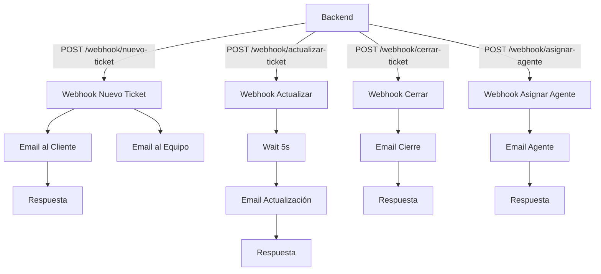

# Documentación Completa del Entorno Docker

Esta documentación describe en detalle la arquitectura Docker del proyecto, cómo se construye y ejecuta cada servicio, las variables de entorno relevantes, puertos, volúmenes, healthchecks, y los flujos de n8n con los ajustes recientes para `client_phone` y `department`.

## Visión General
- Orquestación: `docker-compose.yml` (desarrollo) y `docker-compose.prod.yml` (producción)
- Servicios principales:
  - `database` (PostgreSQL 15)
  - `backend` (Flask + Gunicorn)
  - `frontend` (React build servido con Nginx)
  - `n8n` (Automatización y notificaciones)
  - `redis` (opcional, perfil de producción)

## Arquitectura de Contenedores (Desarrollo)

### Database (`tickkk-database`)
- Imagen: `postgres:15-alpine`
- Puertos: `5432:5432`
- Volúmenes:
  - `postgres_data:/var/lib/postgresql/data`
  - `./backend/init.sql:/docker-entrypoint-initdb.d/init.sql` (se ejecuta al iniciar por primera vez)
- Healthcheck: `pg_isready -U <POSTGRES_USER> -d <POSTGRES_DB>`
- Variables:
  - `POSTGRES_DB` (por defecto `tickkk`)
  - `POSTGRES_USER` (por defecto `tickkk_user`)
  - `POSTGRES_PASSWORD` (por defecto `tickkk_password`)

### Backend (`tickkk-backend`)
- Build: `./backend/Dockerfile`
- Puertos: `9000:5000` (host:container)
- Volúmenes:
  - `./backend:/app` (montaje de código para desarrollo)
  - `backend_logs:/app/logs`
- Healthcheck: `curl -f http://localhost:5000/api/health`
- Variables clave:
  - `POSTGRES_*` (conexión a DB; host `database` y puerto `5432`)
  - `SECRET_KEY`
  - `CORS_ORIGINS` (por defecto `*`)
  - Endpoints n8n (desarrollo apunta a `n8n.cloud`):
    - `N8N_BASE_URL=https://horizontes2025.app.n8n.cloud`
    - `N8N_WEBHOOK_NEW_TICKET=https://horizontes2025.app.n8n.cloud/webhook/nuevo-ticket`
    - `N8N_WEBHOOK_UPDATE_TICKET=https://horizontes2025.app.n8n.cloud/webhook/actualizar-ticket`
    - `N8N_WEBHOOK_CLOSE_TICKET=https://horizontes2025.app.n8n.cloud/webhook/cerrar-ticket`
    - `N8N_WEBHOOK_AGENT_ASSIGNMENT=https://horizontes2025.app.n8n.cloud/webhook/asignar-agente`

### Frontend (`tickkk-frontend`)
- Build: `./frontend/Dockerfile`
- Servidor: Nginx sirviendo el build de React dentro del contenedor (puerto interno `3000`)
- Puertos: `9100:3000` (host:container)
- Volúmenes:
  - `./frontend:/app` (para editar archivos; el build se realiza en imagen)
  - `/app/node_modules` (volumen anónimo en contenedor)
- Healthcheck: `curl -fsS http://localhost:3000/health`
- Variables:
  - `REACT_APP_API_BASE_URL=/api` (proxy Nginx hacia el backend)

Nota: En paralelo puedes ejecutar el servidor de desarrollo local con `npm run start` en el host que escucha en `http://localhost:3000/` (hot-reload). El contenedor de frontend expone `http://localhost:9100/`.

### n8n (`tickkk-n8n`)
- Imagen: `n8nio/n8n:latest` (también disponible `Dockerfile.n8n` para despliegues personalizados)
- Puertos: `9300:5678`
- Volúmenes:
  - `n8n_data:/home/node/.n8n`
  - `./n8n/workflows:/home/node/.n8n/workflows:ro` (montaje de workflows locales, solo lectura)
- Healthcheck: `wget --no-verbose --tries=1 --spider http://localhost:5678/healthz`
- Variables clave:
  - `N8N_BASIC_AUTH_ACTIVE`, `N8N_BASIC_AUTH_USER`, `N8N_BASIC_AUTH_PASSWORD`
  - `N8N_HOST`, `N8N_PORT=5678`, `N8N_PROTOCOL=http`
  - `WEBHOOK_URL=http://localhost:9300/`
  - `GENERIC_TIMEZONE` (por defecto `America/Mexico_City`)
  - SMTP / SendGrid:
    - `SMTP_HOST`, `SMTP_PORT`, `SMTP_USER`, `SMTP_PASS`, `SMTP_FROM`
    - `SENDGRID_API_KEY` (alternativa)
  - Variables para workflows:
    - `EMAIL_DOMAIN` (por defecto `tickkk.com`)
    - `SUPPORT_TEAM_EMAIL` (por defecto `soporte@tickkk.com`)
    - `FRONTEND_URL` (por defecto `http://localhost:9100`)

Expresión de remitente con fallback (en `nuevo-ticket.json`):
```
fromEmail = noreply@{{ $env.EMAIL_DOMAIN || 'tickkk.com' }}
```

### Redis (Opcional)
- Imagen: `redis:7-alpine`
- Puertos: `6379:6379`
- Volumen: `redis_data:/data`
- Healthcheck: `redis-cli ping`
- Perfil: activado en producción.

## Arquitectura de Contenedores (Producción)
- Archivo: `docker-compose.prod.yml`
- Diferencias principales:
  - `restart: unless-stopped` en servicios
  - `N8N_PROTOCOL=https` y `WEBHOOK_URL` configurable
  - `FRONTEND` con `args` para `REACT_APP_API_BASE_URL`
  - Healthchecks con `wget` en frontend y n8n
  - `redis` con `requirepass` y `auth` en healthcheck

## Puertos y URLs
- Frontend (contenedor): `http://localhost:9100/` → Nginx en container (`3000`)
- Frontend (dev server host opcional): `http://localhost:3000/`
- Backend: `http://localhost:9000/` → Gunicorn en container (`5000`)
- n8n: `http://localhost:9300/` → n8n (`5678`)
- Database: `localhost:5432`

## Volúmenes Persistentes
- `postgres_data` → datos de PostgreSQL
- `n8n_data` → datos de n8n (configuración interna)
- `backend_logs` → logs del backend
- `redis_data` → datos de Redis (solo producción)

## Comandos Operativos (PowerShell)
- Ver estado de servicios:
  - `docker compose ps`
- Construir imágenes específicas:
  - `docker compose build frontend n8n`
- Recrear y reiniciar servicios:
  - `docker compose up -d --force-recreate frontend n8n`
- Iniciar todo:
  - `docker compose up -d`
- Detener:
  - `docker compose stop`
- Apagar y remover (cuidado):
  - `docker compose down`
- Logs:
  - `docker compose logs -f backend`
  - `docker compose logs -f frontend`
  - `docker compose logs -f n8n`

## Variables de Entorno (.env)
Coloca un archivo `.env` en el directorio raíz con variables como:

```
POSTGRES_DB=tickkk
POSTGRES_USER=tickkk_user
POSTGRES_PASSWORD=tickkk_password
SECRET_KEY=changeme

# n8n
N8N_BASIC_AUTH_ACTIVE=true
N8N_BASIC_AUTH_USER=admin
N8N_BASIC_AUTH_PASSWORD=admin123
EMAIL_DOMAIN=tickkk.com
SUPPORT_TEAM_EMAIL=soporte@tickkk.com
FRONTEND_URL=http://localhost:9100

# SMTP
SMTP_HOST=smtp.example.com
SMTP_PORT=587
SMTP_USER=user@example.com
SMTP_PASS=supersecret
SMTP_FROM=notificaciones@example.com

# SendGrid (opcional)
SENDGRID_API_KEY=
```

Nota: Si no defines `SENDGRID_API_KEY`, verás una advertencia al ejecutar `docker compose ps`, pero el sistema seguirá funcionando si configuraste SMTP.

## Flujos n8n y Campos Adicionales
- Workflows locales montados en `./n8n/workflows` (solo lectura en contenedor)
- `nuevo-ticket.json` incluye plantillas de correo actualizadas con:
  - `client_phone` y `department` mostrados en emails
  - Fallbacks para email y teléfono en expresiones:
    - Teléfono: `{{ $json.clientPhone || $json.client_phone || 'No especificado' }}`
    - Departamento: `{{ $json.department || 'No especificado' }}`
  - Remitente con fallback: `noreply@{{ $env.EMAIL_DOMAIN || 'tickkk.com' }}`

## Verificación End-to-End
1. Frontend (`http://localhost:9100/`): Crear un nuevo ticket desde la pantalla “Nuevo Ticket”. Completar:
   - Nombre, Email, Número de Celular, Departamento del Hospital, Asunto, Mensaje.
2. Backend (`http://localhost:9000/api/tickets`): Confirmar que el POST incluye `client_phone` y `department`.
3. Detalle del Ticket: Ver que los campos se muestran con iconos.
4. n8n (`http://localhost:9300/`): Validar que el workflow “Notificación Nuevo Ticket” envía correos incluyendo celular y departamento.

## Troubleshooting
- Advertencias en `docker compose ps`:
  - `SENDGRID_API_KEY variable is not set` → configura `SMTP_*` o define `SENDGRID_API_KEY`.
  - `the attribute version is obsolete` → ignorable, proviene de Compose v3.8; puedes eliminar la línea `version`.
- Puerto 3000 ocupado:
  - Si usas el dev server (`http://localhost:3000/`) y el contenedor a la vez, no hay conflicto (distintos contextos). El contenedor expone `9100` hacia `3000` interno.
- Cambios de dependencias frontend:
  - Ejecuta `docker compose build frontend` tras modificar `package.json`.
- Correo no saliente:
  - Revisa `SMTP_*` y/o `SENDGRID_API_KEY` en `.env`.
  - Valida `EMAIL_DOMAIN` para el remitente.
- n8n no ve workflows locales:
  - Confirma el montaje `./n8n/workflows:/home/node/.n8n/workflows:ro` y reinicia `n8n`.

## Seguridad y Buenas Prácticas
- Cambia `SECRET_KEY` y credenciales de `N8N_BASIC_AUTH_*`.
- Limita `CORS_ORIGINS` en producción.
- Usa `restart: unless-stopped` (ya configurado en `docker-compose.prod.yml`).
- Protege credenciales en `.env` (no versionar).

## Copias de Seguridad (PostgreSQL)
- Dump rápido:
  - `docker compose exec database pg_dump -U tickkk_user -d tickkk > backup.sql`
- Restauración:
  - `docker compose exec -T database psql -U tickkk_user -d tickkk < backup.sql`

## Healthchecks de Servicios
- Backend: `GET http://localhost:9000/api/health`
- Frontend: `GET http://localhost:9100/health` (Nginx sirve endpoint de salud)
- n8n: `GET http://localhost:9300/healthz`
- Database: `pg_isready` interno (controlado por Compose)

## Comandos Útiles Adicionales
- Reinicio rápido de servicios afectados:
  - `docker compose up -d --force-recreate frontend n8n`
- Ver variables cargadas:
  - `docker compose config`
- Inspeccionar contenedor:
  - `docker inspect tickkk-frontend`

## Diferencias Clave Dev vs Prod
- Dev:
  - Montajes de código (`./backend:/app`, `./frontend:/app`)
  - Webhooks de n8n apuntan a `n8n.cloud` por configuración actual.
  - Logs en volúmenes dedicados.
- Prod:
  - `restart: unless-stopped`
  - Variables inyectadas desde entorno CI/CD/hosting.
  - Redis activado y securizado.

---

Si necesitas ampliar esta guía con pasos de despliegue remoto o pipelines CI, indícame el entorno objetivo (Render, VPS, on-premise) y preparo el anexo correspondiente.

## Esquema de Base de Datos

El esquema de la base de datos PostgreSQL está definido en `./backend/init.sql` e incluye tipos enumerados para estado, prioridad y roles; tablas para usuarios, tickets y comentarios; índices y triggers para mantener el campo `updated_at`.

- Tipos ENUM:
  - `ticket_status`: `abierto`, `en_proceso`, `cerrado`
  - `ticket_priority`: `baja`, `media`, `alta`, `critica`
  - `user_role`: `admin`, `agent`

- Tabla `users`:
  - `id` (`serial`, PK)
  - `username` (`varchar(150)`, único, requerido)
  - `email` (`varchar(255)`, único, requerido)
  - `password_hash` (`varchar(255)`, requerido)
  - `full_name` (`varchar(255)`)
  - `role` (`user_role`, default `agent`)
  - `is_active` (`boolean`, default `true`)
  - `created_at` (`timestamp`, default `CURRENT_TIMESTAMP`)
  - `updated_at` (`timestamp`, default `CURRENT_TIMESTAMP`)

- Tabla `tickets`:
  - `id` (`serial`, PK)
  - `client_name` (`varchar(255)`, requerido)
  - `client_email` (`varchar(255)`, requerido)
  - `client_phone` (`varchar(20)`, opcional)
  - `subject` (`varchar(500)`, requerido)
  - `description` (`text`, requerido)
  - `status` (`ticket_status`, default `abierto`)
  - `priority` (`ticket_priority`, default `media`)
  - `created_at` (`timestamp`, default `CURRENT_TIMESTAMP`)
  - `updated_at` (`timestamp`, default `CURRENT_TIMESTAMP`)
  - `assigned_to_id` (`integer`, FK → `users.id`, opcional)
  - `assigned_to` (`varchar(255)`, opcional)
  - `category` (`varchar(100)`, opcional)
  - `department` (`varchar(100)`, opcional)

- Tabla `comments`:
  - `id` (`serial`, PK)
  - `ticket_id` (`integer`, FK → `tickets.id`, `ON DELETE CASCADE`)
  - `author_name` (`varchar(255)`, requerido)
  - `author_email` (`varchar(255)`, requerido)
  - `comment_text` (`text`, requerido)
  - `is_internal` (`boolean`, default `false`)
  - `created_at` (`timestamp`, default `CURRENT_TIMESTAMP`)

- Índices:
  - `idx_tickets_status` en `tickets(status)`
  - `idx_tickets_priority` en `tickets(priority)`
  - `idx_tickets_created_at` en `tickets(created_at)`
  - `idx_tickets_client_email` en `tickets(client_email)`
  - `idx_tickets_assigned_to_id` en `tickets(assigned_to_id)`
  - `idx_comments_ticket_id` en `comments(ticket_id)`
  - `idx_comments_created_at` en `comments(created_at)`

- Triggers y funciones:
  - Función `update_updated_at_column()` actualiza `updated_at` en `BEFORE UPDATE`.
  - Trigger `update_tickets_updated_at` en `tickets`.
  - Trigger `update_users_updated_at` en `users`.

- Diagrama ER (simplificado):
```
users (id PK) ─┐
               └─< tickets (assigned_to_id FK → users.id)

tickets (id PK) ──< comments (ticket_id FK → tickets.id, ON DELETE CASCADE)
```

- Fragmento SQL de referencia:
```
CREATE TABLE IF NOT EXISTS tickets (
    id SERIAL PRIMARY KEY,
    client_name VARCHAR(255) NOT NULL,
    client_email VARCHAR(255) NOT NULL,
    client_phone VARCHAR(20),
    subject VARCHAR(500) NOT NULL,
    description TEXT NOT NULL,
    status ticket_status DEFAULT 'abierto',
    priority ticket_priority DEFAULT 'media',
    created_at TIMESTAMP DEFAULT CURRENT_TIMESTAMP,
    updated_at TIMESTAMP DEFAULT CURRENT_TIMESTAMP,
    assigned_to_id INTEGER REFERENCES users(id),
    assigned_to VARCHAR(255),
    category VARCHAR(100),
    department VARCHAR(100)
);
```

## Mapeo Backend → n8n (payloads)

El backend envía datos a los webhooks de n8n desde `backend/app/services/n8n_service.py`. Cada evento incluye campos en `snake_case` y alias en `camelCase` para compatibilidad.

- Nuevo Ticket (`N8N_WEBHOOK_NEW_TICKET`):
  - `ticket_id` / `ticketId`, `client_name` / `clientName`, `client_email` / `clientEmail`, `client_phone` / `clientPhone`, `subject`, `description`, `priority`, `department`, `category`
- Actualización (`N8N_WEBHOOK_UPDATE_TICKET`):
  - Campos anteriores + `comment_text` / `commentText`, `agent_name` / `agentName`, `agent_email` / `agentEmail`
- Cierre (`N8N_WEBHOOK_CLOSE_TICKET`):
  - `ticket_id`, `client_name`, `client_email`, `subject`, `agent_name`, `agent_email`
- Asignación de Agente (`N8N_WEBHOOK_AGENT_ASSIGNMENT`):
  - `ticket_id`, `agent_name`, `agent_email`, `subject`, `priority`, opcionales del cliente

Nota: En n8n el cuerpo del webhook se accede como `{{$json.body.*}}` en estas definiciones.

## Workflows n8n (JSON completo)

A continuación se incluyen los JSON completos de los principales workflows almacenados en `./n8n/workflows/`.

### Notificación Nuevo Ticket

```json
{
  "name": "Notificación Nuevo Ticket",
  "nodes": [
    {
      "parameters": {
        "httpMethod": "POST",
        "path": "nuevo-ticket",
        "responseMode": "responseNode",
        "options": {}
      },
      "id": "d4362efd-23d2-46d8-b332-bb712d7badf0",
      "name": "Webhook Nuevo Ticket",
      "type": "n8n-nodes-base.webhook",
      "typeVersion": 1,
      "position": [
        -224,
        112
      ],
      "webhookId": "nuevo-ticket"
    },
    {
      "parameters": {
        "fromEmail": "soporte@tcleverflix.com",
        "toEmail": "={{ $json.body.client_email }}",
        "subject": "=Hemos recibido tu ticket de soporte [{{ $json.body.ticket_id }}]",
        "emailFormat": "html",
        "html": "=<!DOCTYPE html>\n<html lang=\"en\">\n<head>...contenido completo en archivo...\n</head>\n<body>... incluye client_phone y department ...</body>\n</html>",
        "options": {}
      },
      "id": "2726a58f-2244-4fa5-ae36-1774ca7df278",
      "name": "Email al Cliente",
      "type": "n8n-nodes-base.emailSend",
      "typeVersion": 2,
      "position": [
        0,
        0
      ],
      "webhookId": "d9f7067c-b42f-48df-accc-39ea10f619c2",
      "credentials": {
        "smtp": {
          "id": "tZJkPxhglw1Kfyf1",
          "name": "SMTP account"
        }
      }
    },
    {
      "parameters": {
        "fromEmail": "=soporte@tcleverflix.com",
        "toEmail": "=teamwork@tcleverflix.com",
        "subject": "=🚨 Nuevo Ticket Creado: #{{ $json.body.ticket_id }} por {{ $json.body.client_name }}",
        "emailFormat": "html",
        "html": "=<!DOCTYPE html>\n<html>... incluye client_phone y department ...</html>",
        "options": {}
      },
      "id": "37795e80-7da6-4a7b-846e-861dbd4e20e6",
      "name": "Email al Equipo",
      "type": "n8n-nodes-base.emailSend",
      "typeVersion": 2,
      "position": [
        0,
        208
      ],
      "webhookId": "12b851b8-e133-4e02-993a-3604920c8b04",
      "credentials": {
        "smtp": {
          "id": "tZJkPxhglw1Kfyf1",
          "name": "SMTP account"
        }
      }
    },
    {
      "parameters": {
        "respondWith": "json",
        "responseBody": "={{ { \"success\": true, \"message\": \"Notificaciones enviadas\", \"ticketId\": $json.body.ticketId } }}",
        "options": {}
      },
      "id": "ae2c483c-bb39-4971-bd44-027d6ca0a6a7",
      "name": "Respuesta",
      "type": "n8n-nodes-base.respondToWebhook",
      "typeVersion": 1,
      "position": [
        224,
        112
      ]
    }
  ],
  "pinData": {},
  "connections": {
    "Webhook Nuevo Ticket": { "main": [[ { "node": "Email al Cliente", "type": "main", "index": 0 }, { "node": "Email al Equipo", "type": "main", "index": 0 } ]] },
    "Email al Cliente": { "main": [[ { "node": "Respuesta", "type": "main", "index": 0 } ]] },
    "Email al Equipo": { "main": [[ { "node": "Respuesta", "type": "main", "index": 0 } ]] }
  },
  "active": true,
  "settings": { "executionOrder": "v1" },
  "versionId": "38076392-1fce-4007-8c72-290118006353",
  "meta": { "templateCredsSetupCompleted": true, "instanceId": "76c978ccd60073f365d9e2f156abea6a00f03a27610b0ce06fcd5ae6f2e4f9c4" },
  "id": "UvMdr27JwF1sCrvk",
  "tags": []
}
```

### Notificación Cierre Ticket

```json
{
  "name": "Notificación Cierre Ticket",
  "nodes": [
    { "parameters": { "httpMethod": "POST", "path": "cerrar-ticket", "responseMode": "responseNode", "options": {} }, "id": "6df78713-180c-4184-8901-fc6799052d9b", "name": "Webhook Cerrar", "type": "n8n-nodes-base.webhook", "typeVersion": 1, "position": [0,0], "webhookId": "cerrar-ticket" },
    { "parameters": { "fromEmail": "=soporte@tcleverflix.com", "toEmail": "={{ $json.body.client_email }}", "subject": "=Tu ticket #{{ $json.body.ticket_id }} ha sido resuelto por {{ $json.body.agent_name }}", "emailFormat": "html", "html": "=<!DOCTYPE html>..." }, "id": "6a010458-27f7-4ae3-aba4-9ad2d30bd7be", "name": "Email Cierre", "type": "n8n-nodes-base.emailSend", "typeVersion": 2, "position": [224,0], "webhookId": "2151b337-ef66-461a-a958-81b518ead690", "credentials": { "smtp": { "id": "tZJkPxhglw1Kfyf1", "name": "SMTP account" } } },
    { "parameters": { "respondWith": "json", "responseBody": "={{ { \"success\": true, \"message\": \"Notificación de cierre enviada\", \"ticketId\": $json.body.ticketId } }}" }, "id": "65273ae7-98b5-425f-9fe8-4d3421570163", "name": "Respuesta", "type": "n8n-nodes-base.respondToWebhook", "typeVersion": 1, "position": [448,0] }
  ],
  "connections": { "Webhook Cerrar": { "main": [[ { "node": "Email Cierre", "type": "main", "index": 0 } ]] }, "Email Cierre": { "main": [[ { "node": "Respuesta", "type": "main", "index": 0 } ]] } },
  "active": true,
  "settings": { "executionOrder": "v1" },
  "versionId": "486f31f8-5284-4213-a005-71d560f387d6",
  "meta": { "templateCredsSetupCompleted": true, "instanceId": "76c978ccd60073f365d9e2f156abea6a00f03a27610b0ce06fcd5ae6f2e4f9c4" },
  "id": "9TKper49WL8xeyQa",
  "tags": []
}
```

### Actualizar Ticket - Con Delay

```json
{
  "name": "Actualizar Ticket - Con Delay",
  "nodes": [
    { "parameters": { "httpMethod": "POST", "path": "actualizar-ticket", "responseMode": "responseNode", "options": {} }, "id": "4fa9a993-cd18-4f86-b909-a86315cd3d2e", "name": "Webhook Actualizar", "type": "n8n-nodes-base.webhook", "typeVersion": 1, "position": [0,0], "webhookId": "actualizar-ticket" },
    { "parameters": { "fromEmail": "soporte@tcleverflix.com", "toEmail": "={{ $json.body.client_email }}", "subject": "=Nueva actualización en tu ticket #{{ $json.body.ticket-id }}", "emailFormat": "html", "html": "=<!DOCTYPE html>..." }, "id": "4f9cd73b-6f28-4a30-901f-37363fe80041", "name": "Email Actualización", "type": "n8n-nodes-base.emailSend", "typeVersion": 2, "position": [400,0], "webhookId": "a7351860-a8ff-4c14-ad4e-0ccc4ae3e1dc", "credentials": { "smtp": { "id": "tZJkPxhglw1Kfyf1", "name": "SMTP account" } } },
    { "parameters": { "respondWith": "json", "responseBody": "={{ { \"success\": true, \"message\": \"Notificación de actualización enviada\", \"ticketId\": $json.body.ticket_id } }}" }, "id": "ae726cba-44b0-4634-8ebf-6c53d6d2a3a3", "name": "Respuesta", "type": "n8n-nodes-base.respondToWebhook", "typeVersion": 1, "position": [624,0] },
    { "parameters": {}, "type": "n8n-nodes-base.wait", "typeVersion": 1.1, "position": [208,0], "id": "89060477-3c27-4961-8320-d5f877a6f3b7", "name": " Wait 5 Seconds", "webhookId": "81d81007-1323-4c24-bb0b-4d3d87feae9b" }
  ],
  "connections": { "Webhook Actualizar": { "main": [[ { "node": " Wait 5 Seconds", "type": "main", "index": 0 } ]] }, "Email Actualización": { "main": [[ { "node": "Respuesta", "type": "main", "index": 0 } ]] }, " Wait 5 Seconds": { "main": [[ { "node": "Email Actualización", "type": "main", "index": 0 } ]] } },
  "active": true,
  "settings": { "executionOrder": "v1" },
  "versionId": "7b30214d-a7df-433a-9f95-45e3a77a9298",
  "meta": { "templateCredsSetupCompleted": true, "instanceId": "76c978ccd60073f365d9e2f156abea6a00f03a27610b0ce06fcd5ae6f2e4f9c4" },
  "id": "N4k7HjL8mDQKbOgi",
  "tags": []
}
```

### Asignar Agente - Notificación

```json
{
  "name": "Asignar Agente - Notificación",
  "nodes": [
    { "parameters": { "httpMethod": "POST", "path": "asignar-agente", "responseMode": "responseNode", "options": {} }, "id": "d0cea05c-f11a-46bb-adfa-d46fe1485323", "name": "Webhook", "type": "n8n-nodes-base.webhook", "typeVersion": 1, "position": [0,0], "webhookId": "asignar-agente" },
    { "parameters": { "respondWith": "json", "responseBody": "={\"status\": \"success\", \"message\": \"Agent notification sent\"}" }, "id": "d9fc4566-16ac-476d-9c05-c67780573a7a", "name": "Respond to Webhook", "type": "n8n-nodes-base.respondToWebhook", "typeVersion": 1, "position": [608,0] },
    { "parameters": { "fromEmail": "soporte@tcleverflix.com", "toEmail": "={{ $json.body.agent_email }}", "subject": "=🎫 Nuevo Ticket Asignado #{{ $json.body.ticket_id }} - {{ $json.body.priority }}", "emailFormat": "html", "html": "=<!DOCTYPE html>..." }, "id": "9c411355-a249-46cc-bc71-8d0597109d93", "name": "Send Email", "type": "n8n-nodes-base.emailSend", "typeVersion": 2, "position": [304,0], "webhookId": "fe553d72-abcc-4440-9d9d-e53c00917891", "credentials": { "smtp": { "id": "tZJkPxhglw1Kfyf1", "name": "SMTP account" } } }
  ],
  "connections": { "Webhook": { "main": [[ { "node": "Send Email", "type": "main", "index": 0 } ]] }, "Send Email": { "main": [[ { "node": "Respond to Webhook", "type": "main", "index": 0 } ]] } },
  "active": true,
  "settings": { "executionOrder": "v1" },
  "versionId": "54706ead-82be-4351-9e34-53c0253fabd8",
  "meta": { "templateCredsSetupCompleted": true, "instanceId": "76c978ccd60073f365d9e2f156abea6a00f03a27610b0ce06fcd5ae6f2e4f9c4" },
  "id": "gsKcVL29GAoJkWto",
  "tags": []
}
```

## Campos esperados por cada Webhook

- `nuevo-ticket`:
  - Requiere: `ticket_id`, `client_name`, `client_email`, `subject`, `description`, `priority`
  - Opcionales: `client_phone`, `department`, `category`
- `actualizar-ticket`:
  - Requiere: `ticket_id`, `client_name`, `client_email`, `subject`, `comment_text`
  - Opcionales: `agent_name`, `agent_email`, `department`, `category`
- `cerrar-ticket`:
  - Requiere: `ticket_id`, `client_name`, `client_email`, `subject`, `agent_name`, `agent_email`
- `asignar-agente`:
  - Requiere: `ticket_id`, `agent_name`, `agent_email`, `subject`, `priority`
  - Opcionales: `client_name`, `client_email`, `client_phone`, `department`, `category`, `description`

## Notas de plantillas y expresiones

- Remitente parametrizable: `noreply@{{ $env.EMAIL_DOMAIN || 'tickkk.com' }}`
- Fallbacks típicos:
  - Teléfono: `{{ $json.clientPhone || $json.client_phone || 'No especificado' }}`
  - Departamento: `{{ $json.department || 'No especificado' }}`

## Diagramas Visuales

### ERD (Mermaid)

```mermaid
erDiagram
    USERS {
        int id PK
        varchar name
        varchar email UNIQUE
        varchar password_hash
        user_role role
        timestamp created_at
        timestamp updated_at
    }
    TICKETS {
        int id PK
        varchar client_name
        varchar client_email
        varchar client_phone
        varchar subject
        text description
        ticket_status status
        ticket_priority priority
        timestamp created_at
        timestamp updated_at
        int assigned_to_id FK
        varchar assigned_to
        varchar category
        varchar department
    }
    COMMENTS {
        int id PK
        int ticket_id FK
        varchar author_name
        varchar author_email
        text content
        timestamp created_at
    }
    USERS ||--o{ TICKETS : "asignado a"
    TICKETS ||--o{ COMMENTS : "tiene"
```

### Flujos n8n (Mermaid)



## Migraciones de Base de Datos

- Ubicación sugerida: `backend/migrations/` (ya existe el directorio).
- Convención de nombres: `YYYYMMDD_descripcion.sql`.
- Recomendación: aplicar cambios primero en desarrollo, luego actualizar `backend/init.sql` para mantener el estado base.

### Ejemplos de migraciones

Agregar índice por departamento en `tickets`:

```sql
-- backend/migrations/20251011_add_index_tickets_department.sql
CREATE INDEX IF NOT EXISTS idx_tickets_department ON tickets(department);
```

Agregar columna opcional `hospital_code` en `tickets`:

```sql
-- backend/migrations/20251011_add_column_hospital_code.sql
ALTER TABLE tickets ADD COLUMN IF NOT EXISTS hospital_code VARCHAR(50);
```

### Cómo aplicar migraciones (PowerShell)

- Verificar esquema actual:

```powershell
docker compose exec database psql -U ticket_user -d ticket -c "\\d+ tickets"
```

- Aplicar un archivo de migración:

```powershell
docker compose exec database psql -U ticket_user -d ticket -f backend/migrations/20251011_add_index_tickets_department.sql
```

- Comprobar resultado:

```powershell
docker compose exec database psql -U ticket_user -d ticket -c "SELECT indexname, indexdef FROM pg_indexes WHERE tablename='tickets';"
```

### Rollback rápido (si es necesario)

Nota: Antes de ejecutar rollback, evalúa impacto y dependencias.

```sql
-- Eliminar índice y columna (si existen)
DROP INDEX IF EXISTS idx_tickets_department;
ALTER TABLE tickets DROP COLUMN IF EXISTS hospital_code;
```

### Buenas prácticas

- Mantener las migraciones idempotentes (`IF NOT EXISTS`).
- Versionar y describir claramente cada cambio.
- Probar en una copia de la base (`db/dump-ticket-*.sql`) antes de producción.
- Actualizar `backend/init.sql` tras aplicar migraciones aprobadas.